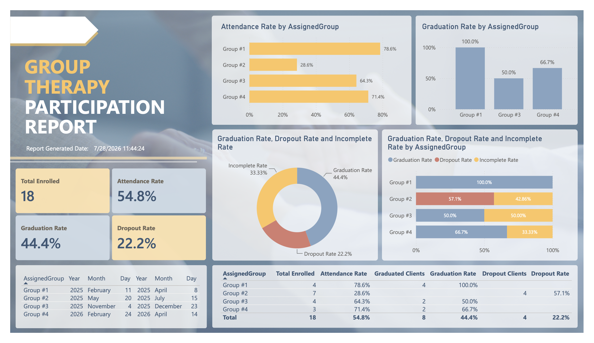
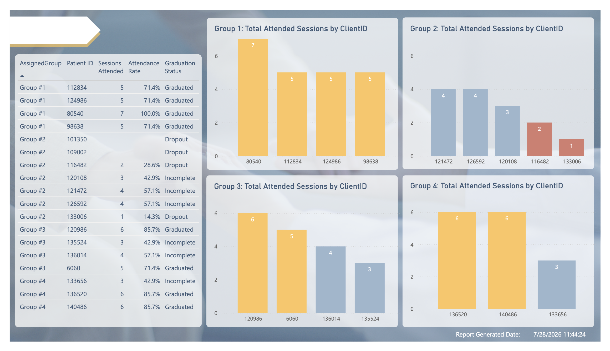
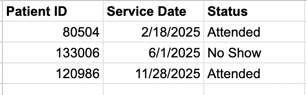
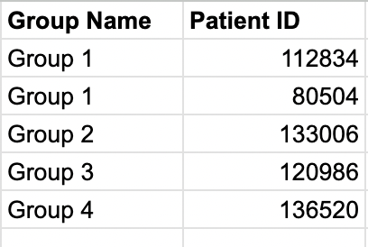
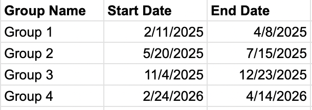
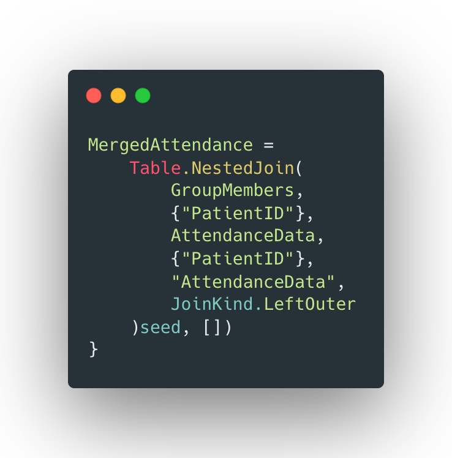
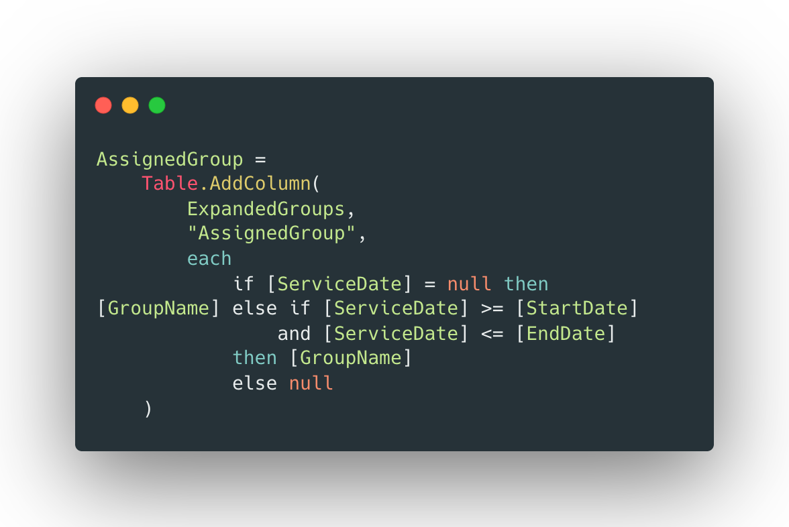

# 🏥 Behavioral Health Group Outcomes Dashboard

> **Power BI • Power Query (M) • DAX • SharePoint • Excel**

An automated Power BI reporting solution that integrates enrollment, attendance, and cohort configuration data to provide real-time behavioral health program outcome reporting.

---

## 📌 Project Overview

Behavioral health staff previously relied on manual spreadsheets to calculate attendance, graduation, incomplete participation, and dropout metrics for recurring treatment groups. As new cohorts were created, reports required manual updates and repeated calculations.

This project automated the reporting process by combining enrollment, attendance, and cohort configuration data into a scalable Power BI solution that supports future cohorts without requiring report redesign or manual calculation updates.

---

# 📊 Dashboard Overview




The dashboard provides:

- Executive KPI cards
- Attendance rate tracking
- Graduation and dropout monitoring
- Cohort performance comparison
- Interactive filtering and drill-through
- Program-level and cohort-level reporting

---

# 🏗 Solution Architecture

# Solution Architecture

SharePoint Files

↓

Power Query

↓

Data Model

↓

DAX Measures

↓

Interactive Dashboard


---

# 📁 Data Sources Samples




---

# 🔄 ETL Process

The reporting model was built using Power Query to transform multiple source files into an analytics-ready dataset.

### Transformations

- Imported cloud-hosted Excel files from SharePoint
- Standardized enrollment and attendance data
- Removed duplicate records
- Applied data type conversions
- Merged enrollment and attendance tables
- Preserved participants with no attendance records
- Assigned attendance to the correct cohort using date ranges
- Created configurable lookup tables for future groups

---

# ⚙ Power Query Highlights

## Preserving Enrolled Participants

The reporting model starts with enrollment data rather than attendance data to ensure participants with no attendance records remain included in outcome calculations.

### Left Outer Join



---

## Dynamic Cohort Assignment

Participants may enroll in multiple behavioral health groups over time.

Attendance is assigned to the correct cohort using configurable date ranges.



---

# 📐 Data Model

The model follows a relational design connecting enrollment, attendance, providers, and group configuration tables.

SharePoint Excel Files
        │
        ├──────────────┐
        │              │
        ▼              ▼
Group Roster     Attendance
        │              │
        └──────┬───────┘
               ▼
        Left Outer Join
               │
               ▼
     Cohort Assignment Logic
(ServiceDate between StartDate and EndDate)
               │
               ▼
       Power BI Data Model
               │
               ▼
          DAX Measures
               │
               ▼
     Executive Dashboard

---


# 📈 DAX Measures

Custom DAX measures were developed to support attendance and outcome reporting.

## Total Enrolled

```DAX
Total Enrolled =
COUNTROWS(
    SUMMARIZE(
        'Main Data',
        'Main Data'[PatientID],
        'Main Data'[GroupName]
    )
)
```

---

## Attendance Rate

```DAX
Attendance Rate =
DIVIDE(
    [Total Attended Sessions],
    [Total Possible Sessions],
    0
)
```

---

## Graduated Clients

```DAX
Graduated Clients =
COUNTROWS(
    FILTER(
        SUMMARIZE(
            'Main Data',
            'Main Data'[PatientID],
            'Main Data'[GroupName]
        ),
        CALCULATE(
            COUNTROWS('Main Data'),
            'Main Data'[STATUS]="Kept"
        ) >= 5
    )
)
```

---

# 📋 Business Rules

| Metric | Rule |
|--------|------|
| Attendance | Status = "Kept" |
| Graduated | 5–7 sessions attended |
| Incomplete | 2–4 sessions attended |
| Dropout | 0–1 sessions attended |
| Enrollment | Include participants with no attendance |

---

# 💡 Technical Challenges

## Missing Attendance Records

**Problem**

Participants with no attendance disappeared from reports.

**Solution**

Built the reporting model from enrollment data and used a Left Outer Join to preserve participants with no attendance.

---

## Repeat Participation

**Problem**

Some participants enrolled in multiple behavioral health groups.

**Solution**

Implemented dynamic date-range logic to associate attendance with the correct cohort.

---

## Scalability

**Problem**

Adding future cohorts required modifying queries.

**Solution**

Created configurable mapping tables so new groups can be added without changing Power Query or DAX logic.

---

# 📊 Dashboard Features

- Executive KPI cards
- Attendance tracking
- Graduation monitoring
- Dropout analysis
- Cohort comparison
- Interactive slicers
- Drill-through reporting


---

# ✅ Results

- Automated recurring attendance and outcome reporting
- Eliminated manual spreadsheet calculations
- Improved reporting accuracy by including participants with zero attendance
- Reduced report maintenance through configurable cohort mappings
- Created a scalable reporting framework for future behavioral health groups

---

# 🛠 Skills Demonstrated

### Power BI

- Dashboard Development
- Interactive Reporting
- KPI Design
- Data Modeling

### Power Query

- ETL Development
- Merge Queries
- Data Transformation
- Custom M Code
- Lookup Tables

### DAX

- Custom Measures
- Business Rule Implementation
- KPI Calculations

### Analytics

- Cohort Analysis
- Attendance Tracking
- Retention Analysis
- Outcome Measurement

### Data Integration

- SharePoint
- Excel
- Automated Refresh
- Scalable Reporting Architecture

---

# 📸 Additional Screenshots

## Executive Dashboard


---

## KPI Cards


---

## Cohort Matrix


---

## Power Query Applied Steps


---

## Data Model


---

## Before vs After Transformation


